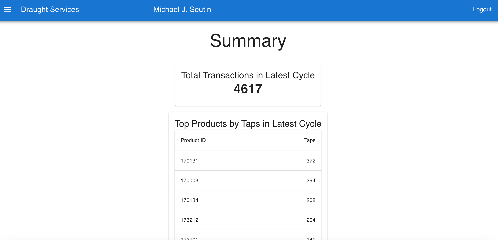
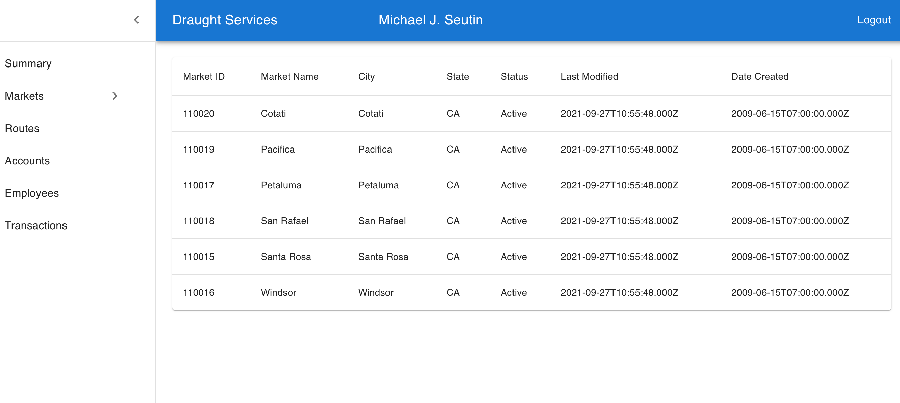
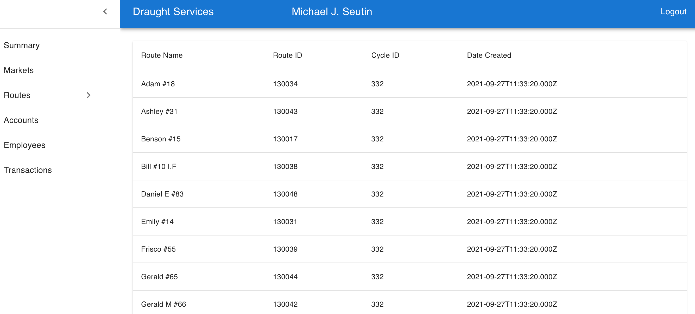
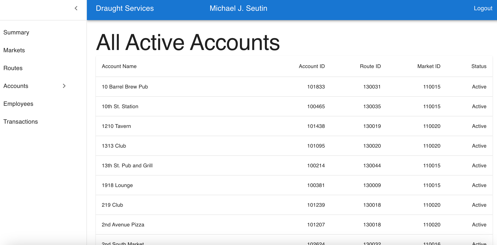
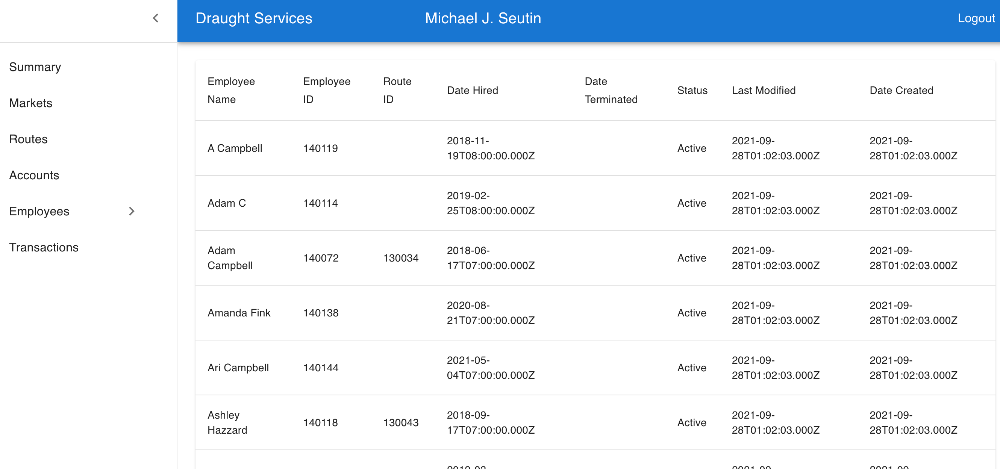
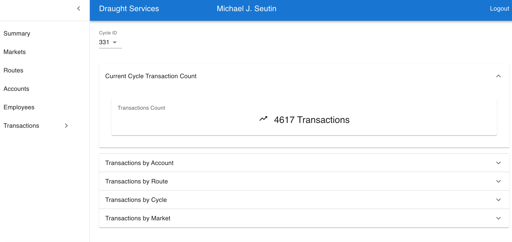
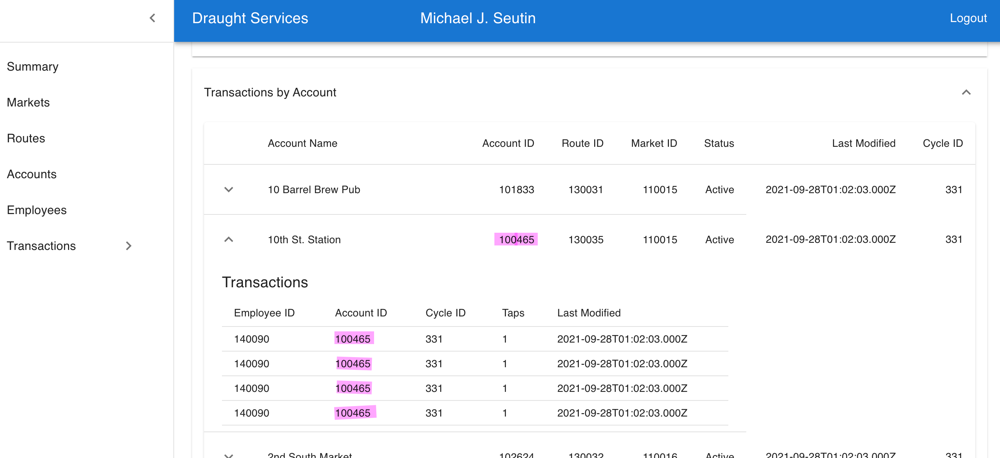
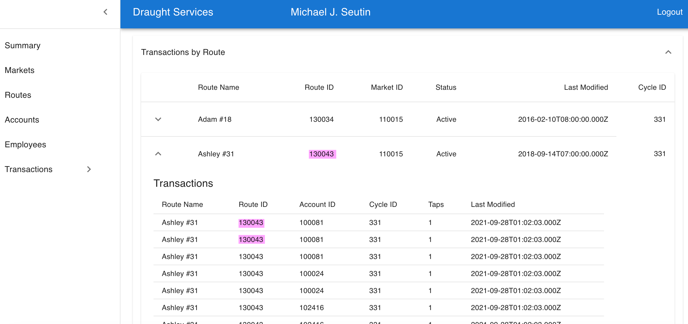
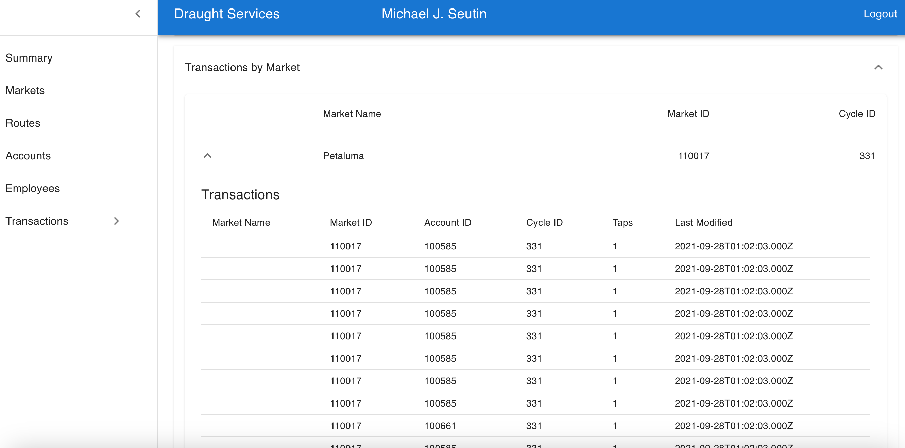

# Michael Seutin React + Postgress

## Recap

I was able to implement all routes. The code could use some refactoring and some cleanup. The Transactions were the most challenging. I used the collapsible table form Material UI for most Transactions and the inner table works as intended, see screenshots below. Some of the inner tables are so large that closing them can take a few seconds. I am not sure if there was a better way of doing it.

## Summary Page (landing page)

## Market Page

## Routes Page

## Accounts Page

## Employees Page

## Transactions Page
### Transactions Total Count

### Transactions By Account

### Transactions By Route

### Transactions By Cycle

### Transactions by Market
